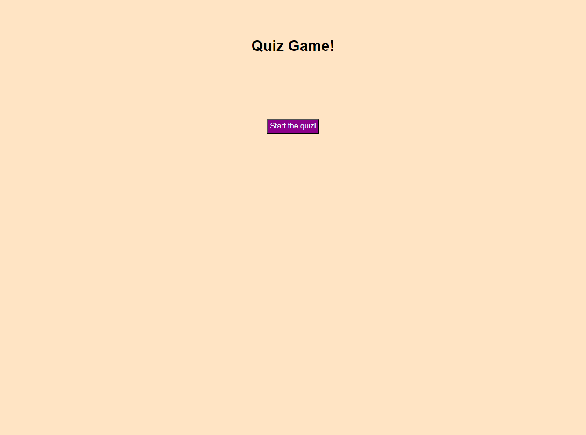
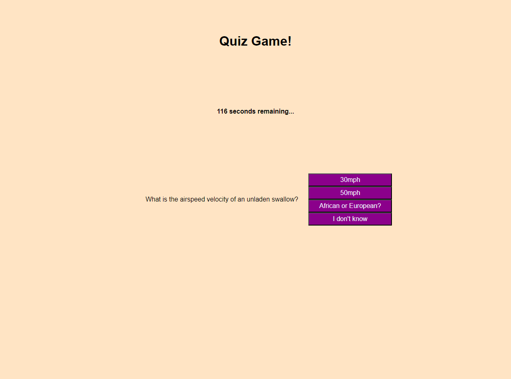
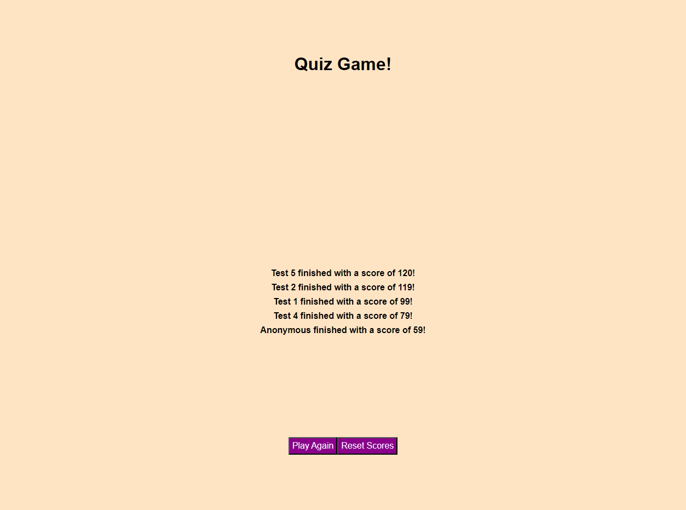

# **Module 4 Challenge:** Quiz Game

## Description

The goal of this project was to create an interactive quiz game that dynamically created and displayed questions and answers. After answering a question, the user would see that the previous question disappears, and the next one shows up. Incorrect questions would steal time from a timer, and at the end of it all, the user would be prompted to save their score and a scoreboard would be populated using the local storage. 

The main language used in this project was JavaScript, as the intent was to create/change most of the webpage dynamically using event listeners. Event bubbling and targeting parent elements were key ideas that were needed to accomplish this goal.

## Preview

The project can be found at [this address](https://github.io/ZSchreier/quiz-game).

The following three screenshots show the start of the quiz, one of the questions, and an example scoreboard:

